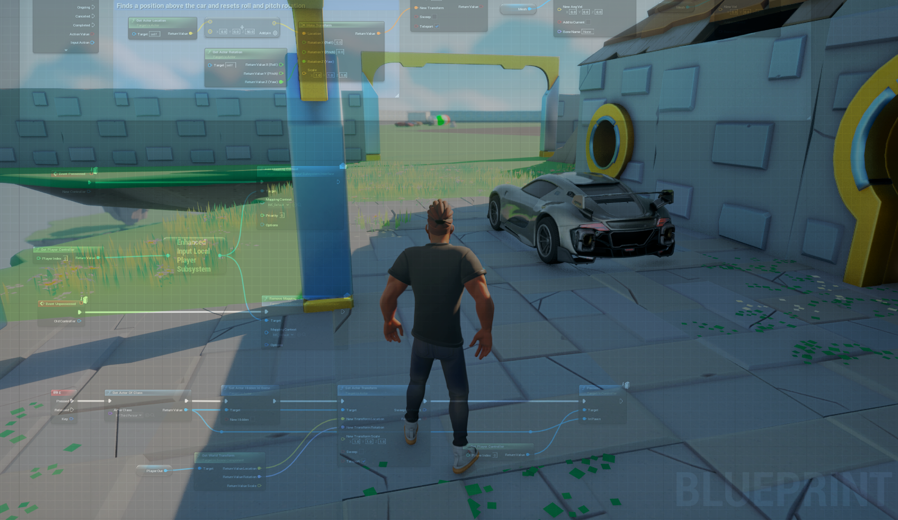
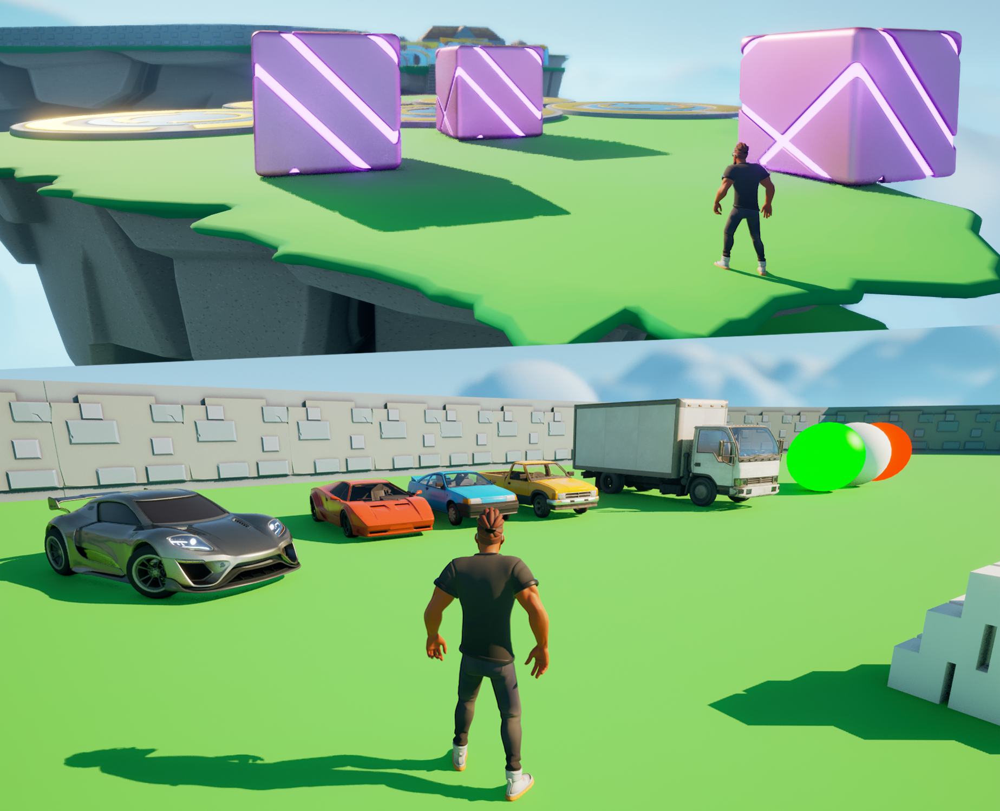
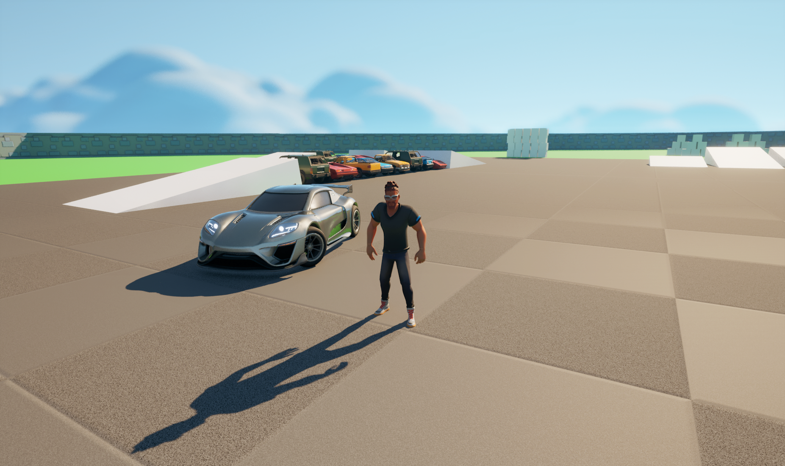

## Open World Game

**This project was developed using Unreal Engine 5.2 with C++ and Blueprint features.**
 
 

In this game, the character should pass through challenging obstacles before reaching to reward. On the last ground, the character will be able to drive a sports car and experience accelerating, car jumping, and drifting.
 

By going to the SportsCar_Pawn Blueprint Class, the details of the car (steering wheel, engine, brake, mass) are adjustable to customize the car.
 

## Future Work

Add more features to the project, some ideas are: enter and exit car animations, UIs and HUDs, more playable/drivable cars, etc. Any contributions to this project would be greatly appreciated. 

## References

This project was developed on top of [Unreal Engine 5 C++ Developer course](https://www.udemy.com/course/unrealcourse/).

All used assets and packs are available to download from Unreal Engine Marketplace:
 
[Stylized Character Kit: Casual 01](https://www.unrealengine.com/marketplace/en-US/product/stylized-male-character-kit-casual/)
 
[Unreal Learning Kit](https://www.unrealengine.com/marketplace/en-US/product/unreal-learning-kit/)
 
[Vehicle Variety Pack](https://www.unrealengine.com/marketplace/en-US/product/bbcb90a03f844edbb20c8b89ee16ea32/)

